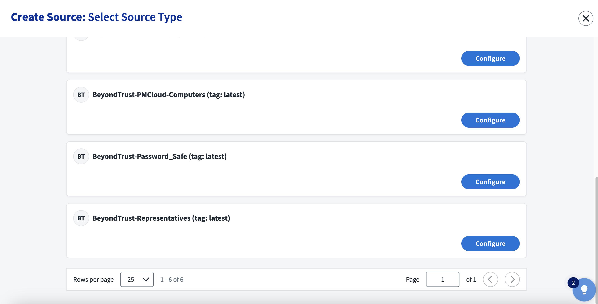
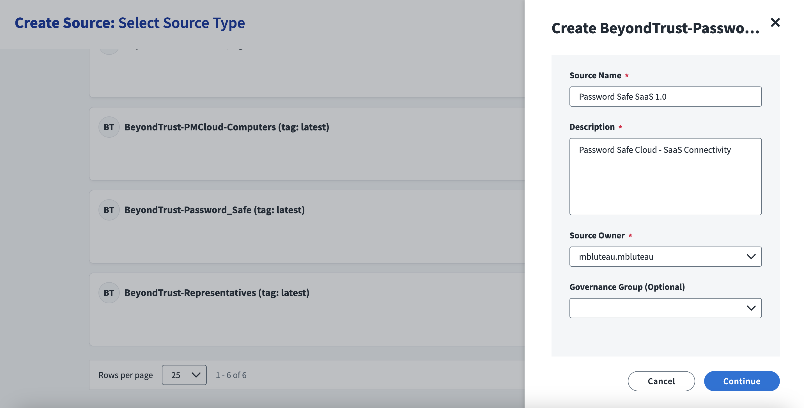
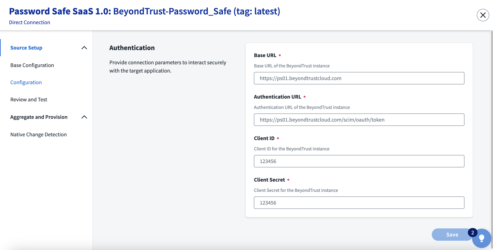
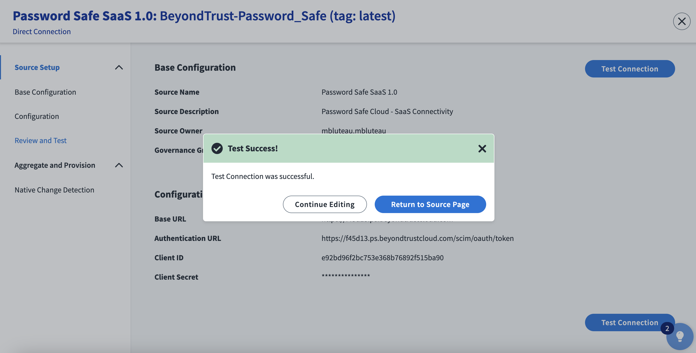

<!DOCTYPE html>
<html>
<body>

<h1>SailPoint IdentityNow SaaS Connectivity  :: BeyondTrust Password Safe</h1>

<h2>PAM and SCIM PAM working example</h2>
  
  The BeyondTrust Password Safe SaaS Connector has been created using <a href="https://developer.sailpoint.com/idn/docs/saas-connectivity/">SailPoint IdentityNow SaaS Connectivity</a>.
  
  Password Safe was added to IdentityNow as the first default PAM Source in March 2022.
  However, a SaaS Connector allows direct Cloud to Cloud communication without requiring a VA to be deployed on-premises, to Password Safe Cloud.

  This SaaS Connector is an example for how to implement a fully working example based on SCIM and SCIM PAM extension.

  For more information on SCIM, see <a href="http://www.simplecloud.info">SCIM</a> and <a href="http://www.simplecloud.info">SCIM PAM</a>

<h3>Supported Use Cases</h3>

- Account Create
- Account Delete
- Account Enable
- Account Disable
- Account List
- Account Read
- Account Update
- Entitlement List
- Entitlement Read
- Test Connection

<h3>Requirements</h3>

IdentityNow v8.3+
SailPoint SaaS Connectivity
BeyondTrust Password Safe Cloud v23.3+

<h3>Configuration Guide</h3>

Once the Password Safe SaaS Connector has been added to our IdentityNow instance, we can use it to create a new Source.

   
  
  Click Configure Source, provide a Name and Description, then click Continue.

   
  
  Provide the Base URL and Authentication URL for your Password Safe Cloud instance. Also provide Client ID and Secret for the SCIM service account.
  For more information on creating the IdentityNow SCIM service account, refer to <a href="https://www.beyondtrust.com/docs/beyondinsight-password-safe/bi/integrations/third-party/identity-now.htm">Create Group and Account</a>

   
  
  At this point, you should be able to successfully test the connection.
  
   
  
  Click Configure Source, provide a Name and Description, then click Continue.

  </body>
  </html>
